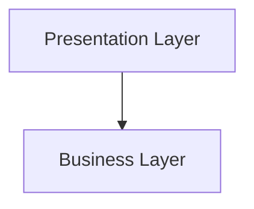

# Team 5 Architecture Document
___
**Table of Contents**

- [Team 5 Architecture Document](#team-5-architecture-document)
  - [1.0 Introduction](#10-introduction)
  - [2.0 High Level Hierarchy](#20-high-level-hierarchy)
    - [2.1 Hierarchy Diagram](#21-hierarchy-diagram)
    - [2.2 Hierarchy Description](#22-hierarchy-description)
  - [3.0 Components Classification](#30-components-classification)
    - [3.1 Presentation Layer](#31-presentation-layer)
    - [3.2 Business Layer](#32-business-layer)
  - [4.0 Process View](#40-process-view)
    - [4.1 Process View Description](#41-process-view-description)
    - [4.2 Application Thread](#42-application-thread)
    - [4.3 Thread Listener/Sender](#43-thread-listenersender)

___
## 1.0 Introduction

Team 5 Architecture Document is designed to illustrate and identify the architecture system used to design and implement the chat application. The document contains an overall view of the system hierarchy, logical views of the system components, and a process view of the system's communication.
___
## 2.0 High Level Hierarchy
### 2.1 Hierarchy Diagram

### 2.2 Hierarchy Description

The architecture system is based on these 2 principal layers, Presentation Layer which contains the User Interface(UI) and Business Layer which is responsable for the logical part of the application.
___
## 3.0 Components Classification

### 3.1 Presentation Layer
**Purpose:** To display a simple, yet effective, chat area where users can write messages and communicate with others. 

**Specific Nature:** The task of the presentation layer will be to display a textarea where messages are shown, a textfield where users enter their message, a list of users and tabs to divide public and private chats. This layer will also handle user event clicks and input events.

### 3.2 Business Layer

**Purpose:** This layer will contain all the managment of the communication between the potato chat client and the server.

**Specific Nature:** The task of this layer is to mask the communication between client and server to the presentation layer. It will handle all the packets that are created by the client and all the packets that are sent by the server. This layer contains an interface called ChatService, that is implemented by a class, called ChatServiceImpl, that will override all the methods of the interface that are needed for the communication between client and server.

**Associated Constructs:** ChatServiceImpl
- login(String alias, String topic)
  - This method is used to login to a public chat by sending a packet to the server.

- loginAck(byte[] ack)
  - This method recives the packet from the server after the login, thanks to the thread that listener. This will contain the alias and an unique id. 

- requireUserList()
  - This method is used to require the list sent by the server of all the connected users of the public chat. 

- sendMsgToUser(String message,String destAlias)
  - The task of this method is to send a private message to a user. The server listens to the packet created by this method and forwards it to the destination.

- receiveMsgFromUser(byte[] userPkt)
  - This receives the message of a user.

- sendMsgToChat(String message)
  - The task of the method is to send a public message to the server, that handles the packet sent.

- receiveMsgFromChat(byte[] chatPkt)
  - It receives the message from other users that are connected to the public chat.

- disconnect()
  - This method disconnects you from the server when the window is closed.

- disconnectedByServer(byte[] disconnected)
  - This method gets invoked when the server sends, after a certain amount of time, the packet for disconnection.

- changeAlias(String alias)
  - The task of this method is to change the alias.

___
## 4.0 Process View

### 4.1 Process View Description

The Process View is essential in understanding how the separate components and subcomponents communicate with each other in a concurrent application. By better understanding the necessary paths of communication between the components, it may be possible to optimize the data flow and storage of the application.

### 4.2 Application Thread

This is the thread that is created when a new instance of the Login JFrame panel is created. It represents the main thread of the application that contains the Presentation Layer(UI).

### 4.3 Thread Listener/Sender

This thread is responsible for listening to all the packets that are sent by the server and also it is used for sending packets to the server.