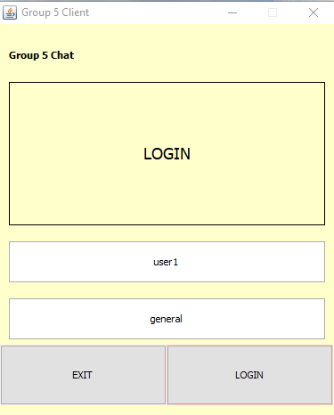

# Potato Chat Client User Guide

#### Team 5 
#### April 20, 2020

##### Team Members
- Gjergjaj Albert
- Donisan Ion Cristian
- Quintarelli Federico
- Scardoni Francesco
- Castellano Pietro
___

## Table of Contents
  - [Introduction](#introduction)
  - [Getting Started](#getting-started)
    - [System requirements](#system-requirements)
    - [Quick start](#quick-start)
  - [Launching the application](#launching-the-application)
  - [Using the General Room](#using-the-general-room)
  - [Using the private room](#using-the-private-room)
  - [Troubleshooting](#troubleshooting)
    - [Incorrect alias](#incorrect-alias)

___

## Introduction

The Potato Chat client allows users to chat in a fast way, like never before. It offers a simple but effective interface that is easy to use. You can join group chats or you can chat with other users privately. 
This document will provide instructions on how to use the client.
___

## Getting Started
### System requirements
A Windows, Mac or Linux computer with Java installed

### Quick start
Follow these steps to make a jar of the application.

1. Visit https://github.com/albertgj/5Ei_Group5Chat.git and download the projet.
2. Open the project with an IDE, for example NetBeans.
3. Right-click on the Project name.
4. Select Build or Clean and Build.
5. Right-click on the project
6. Select Run to run the application
___
## Launching the application

After the application starts you will see the login screen.

1. Here you will put the alias and the topic of the chat.
2. Then press the login button to login or the exit button to close the application.

___
## Using the General Room
If the login is succsesful you will see the general chat room.

- The general room is the default room where you can chat with other connected users. 
- After a certain period of time the server disconnects you and the application closes
- You can type the message in the text field and press the send button to send your message to all the users. 
- You can also find the list of all connected users. 
- You can refresh the list by pressing the request user list button. 
- In the list you can double tap on any name, this will create a new tab where you can chat with a user privately.

___
## Using the private room
After clicking on a user in the list, a new tab will appear with the name of the user that you clicked.

- Here you can send private messages to that user by pressing the send button. 
- To close the connection with the user and to close the tab you have to double click on the tab that you want to close and this will close it.

___
## Troubleshooting

### Incorrect alias
If you can't login it means that the alias has already been taken or it doesn't meet the requirements (the alias shouldn't be longer than 12 characters). Otherwise you have to check if the server is online.
